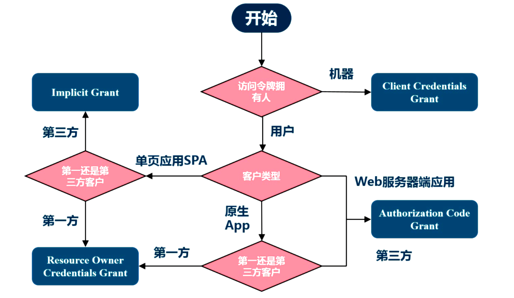

# 微服务架构实战

## OAuth2

### OAuth2解决问题域和场景

* 开放系统间授权
  * 社交联合登录
  * 开放API平台

* 现代微服务安全
  * 单页浏览器App ( HTML5/JS/无状态)
  * 无线原生App
  * 服务器端WebApp
  * 微服务和API间调用

* 企业内部应用认证授权( IAM/SSO )

### 什么是OAuth 2.0

* 用于REST/APIs的代理授权框架(delegated authorization framework)

* 基于令牌Token的授权,在无需暴露用户密码的情况下,使应用能获取对用户数据的有限访问权限事实上的标准安全框架

* 解耦认证和授权

* 支持多种用例场景
  * 服务器端WebApp
  * 浏览器单页SPA
  * 无线/原生App
  * 服务器对服务器之间
  
### OAuth 2.0优势

* OAuth 2.0比OAuth 1.0易于实现
* 广泛传播并被持续采用
* 资源服务器和授权服务器解耦
* HTTP/JSON友好易于请求和传递token
* 客户可以具有不同的信任级别
* 更安全，客户端不接触用户密码,服务器端更易集中保护
* 短寿命和封装的token
* 集中式授权,简化客户端
* 考虑多种客户端架构场景

### OAuth 2.0不足

* 协议框架太宽泛,造成各种实现的兼容性和互操作性差
* 和OAuth 1.0不兼容
* OAuth 2.0不是一个认证协议OAuth 2.0本身并不能告诉你任何用户信息

### OAuth术语

* 客户应用(Client Application)
  * 通常是一个Web或者无线应用,它需要访问用户的受保护资源
* 资源服务器(Resource Server)
  * 是一个web站点或者web serviceAPI ,用户的受保护数据保存于此
* 授权服务器(Authorized Server)
  * 在客户应用成功认证并获得授权之后,向客户应用颁发访问令牌Access Token
* 资源拥有者(Resource Owner)
  * 资源的拥有人,想要分享某些资源给第三方应用
  
### 四种OAuth 2.0授权类型(Flows)

* 授权码Authorization Code
  * 通过前端渠道客户获取授权码
  * 通过后端渠道,客户使用authorization code去交换access Token和可选的refresh token
  * 假定资源拥有者和客户在不同的设备上
  * 最安全的流程,因为令牌不会传递经过user-agent

* 简化Implicit
  * 适用于公开的浏览器单页应用
  * Access Token直接从授权服务器返回(只有前端渠道)
  * 不支持refresh tokens
  * 假定资源所有者和公开客户应用在同一个设备上
  * 最容易受安全攻击

* 用户名密码Resource Owner Credentials
  * 使用用户名密码登录的应用,例如桌面App
  * 使用用户名/密码作为授权方式从授权服务器上获取access token
  * 一般不支持refresh tokens
  * 假定资源拥有者和公开客户在相同设备上

* 客户端凭证Client Credentials
  * 适用于服务器间通信场景,机密客户代表它自己或者一个用户
  * 只有后端渠道,使用客户凭证获取一个access token
  * 因为客户凭证可以使用对称或者非对称加密,该方式支持共享密码或者证书
  
 

