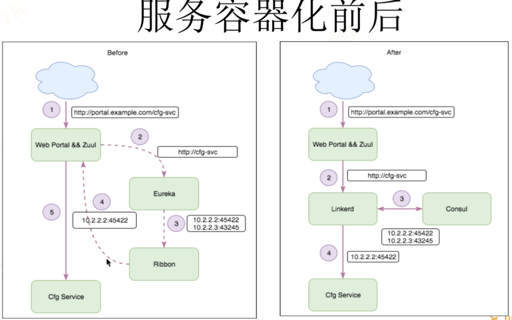

# Service Mesh

专用基础设施层:独立的运行单元。

包括数据层和控制层:数据层负责交付应用请求，控制层控制服务如何通讯。轻量级透明代理:实现形式为轻量级网络代理。

处理服务间通讯:主要目的是实现复杂网络中服务间通讯。

可靠地交付服务请求:提供网络弹性机制，确保可靠交付请求。

与服务部署一起，但服务无需感知:尽管跟应用部署在一起，但对应用是透明的。

## Service Mesh能做什么

Service Mesh作为透明代理，它可以运行在任何基础设施环境，而且跟应用非常靠近，那么，Service Mesh能做什么呢?

负载均衡:运行环境中微服务实例通常处于动态变化状态，而且经常可能出现个别实例不能正常提供服务、处理能力减弱、卡顿等现象。但由于所有请求对Service 
Mesh来说是可见的，因此可以通过提供高级负载均衡算法来实现更加智能、高效的流量分发，降低延时，提高可靠性。

服务发现:以微服务模式运行的应用变更非常频繁，应用实例的频繁增加减少带来的问题是如何精确地发现新增实例以及避免将请求发送给已不存在的实例变得更加复杂。Service Mesh可以提供简单、统一、 平台无关的多种服务发现机制，如基于DNS, KN键值对存储的服务发现机制。

熔断:动态的环境中服务实例中断或者不健康导致服务中断可能会经常发生，这就要求应用或者其他工具具有快速监测并从负载均衡池中移除不提供服务实例的能力，这种能力也称熔断，以此使得应用无需消耗更多不必要的资源不断地尝试，而是快速失败或者降级，甚至这样可避免一些潜在的关联性错误。而Service Mesh可以很容易实现基于请求和连接级别的熔断机制。

动态路由:随着服务提供商以提供高稳定性、高可用性以及高SLA服务为主要目标，为了实现所述目标，出现各种应用部署策略尽可能从技术手段达到无服务中断部署，以此避免变更导致服务的中断和稳定性降低，例如: 
Blue/Green部署、Canary部署，但是实现这些高级部署策略通常非常困难。关于应用部署策略，可参考Etienne 
Tremel的文章，他对各种部署策略做了详细的比较。而如果运维人员可以轻松的将应用流量从staging环境到生产线环境，一个版本到另外一个版本，更或者从一个数据中心到另外一个数据中心进行动态切换，甚至可以通过一个中心控制层控制多 
少比例的流量被切换。那么Service Mesh提供的动态路由机制和特定的部署策略如Blue/Green部署结合起来，实现上述目标更加容易。

安全通讯:无论何时，安全在整个公司、业务系统中都有着举足轻重的位置，也是非常难以实现和控制的部分。而微服务环境中，不同的服务实例间通讯变得更加复杂，那么如何保证这些通讯是在安全、授权情况下进行非常重要。通过将安全机制如TLS加解密和授权实现在Service Mesh上，不仅可以避免在不同应用的重复实现，而且很容易在整个基础设施层更新安全机制，甚至无需对应用做任何操作。多语言支持:由于Service Mesh作为独立运行的透明代理，很容易支持多语言。多协议支持:同多语言支持一样，实现多协议支持也非常容易。

指标和分布式追踪: Service Mesh对整个基础设施层的可见性使得它不仅可以暴露单个服务的运行指标，而且可以暴露整个集群的运行指标。

重试和最后期限: Service Mesh的重试功能避免将其嵌入到业务代码，同时最后期限使得应用允许一个请求的最长生命周期，而不是无休止的重试。

 

### 边车SideCar模式

* 负载均衡
* 动态路由
* 容错限流
* 监控度量
* 安全日志

## 监控

### Metrics种类

* Counter(计数器)
  * 始终增加
  * http请求数，下单数
* Gauge(测量仪)
  * 当前值的一次快照(snapshot)测量，可增可减
  * 磁盘使用率，当前同时在线用户数
* Histogram(直方图)
  * 通过分桶(bucket)方式统计样本分布
* Summary(汇总)
  * 根据样本统计出百分位
  * 客户端计算

### Prometheus

* 四个黄金指标(Google)
  * 延迟： 服务请求所需耗时
    * 例如HTTP请求平均延迟
  * 流量/吞吐： 衡量服务容量需求
    * 例如每秒处理HTTP请求数
  * 错误： 衡量错误发生的情况
    * 例如HTTP 500错误数
  * 饱和度： 衡量资源使用情况
    * 例如CPU/内存/磁盘使用量

Cardinality(基数)

*  Label的可能取值
* 新增一个Label值=新增一个时间序列
* 经验值：单实例Cardinality <= 10个
* 不适合做Label
  *  Email地址
  * 用户名
  * IP地址
  * HTTP Path
*  关注10个最大的metrics
* 高Cardinality场景用Log系统

### Exporters

* OS - Node Exporter
  * Linux, Windows
* Database
  * Mysql, Postgres, CouchDB...
* Messaging
  * Kafka, RabbitMQ, NATS...
* Logging
  * ElasticSearch, Fluentd, Telegraf..
* Key-Value
  * Redis, Memcached...
* WebServer
  * Apache, Nginx...
* Proxy
  * Haproxy, Varnish...
* DNS
  * BIND, PowerDNS, Unbound
* BlackBox

4小时磁盘是否满？

### 四层轻量监控体系

* 系统层监控
* 应用层监控
* 业务层监控
* 端用户体验监控