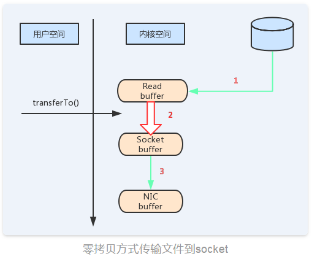

## MQ
#### 异步消息、解耦、流量削峰
### 1、ActiveMQ
#### 1. 什么是MOM
<br>面向消息的中间件，使用消息传送提供者来协调消息传输操作。 MOM需要提供API和管理工具。 客户端调用api。 把消息发送到消息传送提供者指定的目的地
在消息发送之后，客户端会技术执行其他的工作。并且在接收方收到这个消息确认之前。提供者一直保留该消息。
#### 2. 消息传递
<br>1) 点对点(p2p)
<br><br>a.	如果session关闭时，有一些消息已经收到，但还没有被签收，那么当消费者下次连接到相同的队列时，消息还会被签收；
<br><br>b.	如果用户在receive方法中设定了消息选择条件，那么不符合条件的消息会留在队列中不会被接收；
<br><br>c.	队列可以长久保存消息直到消息被消费者签收。消费者不需要担心因为消息丢失而时刻与jmsprovider保持连接状态。
<br><br>2) 发布订阅(pub/sub)
<br><br>a.	订阅可以分为非持久订阅和持久订阅；
<br><br>b.	当所有的消息必须接收的时候，则需要用到持久订阅。反之，则用非持久订阅。
<br><br>3. 消息组成
<br><br>a. 消息头
<br>包含消息的识别信息和路由信息
<br><br>b. 消息体
<br>TextMessage
<br>MapMessage
<br>BytesMessage
<br>StreamMessage   输入输出流
<br>ObjectMessage  可序列化对象
#### 3. JMS的可靠性机制
<br>JMS消息之后被确认后，才会认为是被成功消费。消息的消费包含三个阶段： 客户端接收消息、客户端处理消息、消息被确认
<br><br>1) 事务性会话
<br>消息会在session.commit以后自动签收
<br><br>2) 非事务性会话
<br>在该模式下，消息何时被确认取决于创建会话时的应答模式
<br><br>AUTO_ACKNOWLEDGE
<br>当客户端成功从receive方法返回以后，或者[MessageListener.onMessage]方法成功返回以后，会话会自动确认该消息
<br><br>CLIENT_ACKNOWLEDGE
<br>客户端通过调用消息的textMessage.acknowledge();确认消息。
<br>在这种模式中，如果一个消息消费者消费一共是10个消息，那么消费了5个消息，然后在第5个消息通过textMessage.acknowledge()，那么之前的所有消息都会被消确认
<br><br>DUPS_OK_ACKNOWLEDGE
<br>延迟确认
<br><br>3) 本地事务
<br>在一个JMS客户端，可以使用本地事务来组合消息的发送和接收。JMSSession接口提供了commit和rollback方法。
JMSProvider会缓存每个生产者当前生产的所有消息，直到commit或者rollback，commit操作将会导致事务中所有的消息被持久存储；rollback意味着JMSProvider将会清除此事务下所有的消息记录。在事务未提交之前，消息是不会被持久化存储的，也不会被消费者消费
事务提交意味着生产的所有消息都被发送。消费的所有消息都被确认； 
事务回滚意味着生产的所有消息被销毁，消费的所有消息被恢复，也就是下次仍然能够接收到发送端的消息，除非消息已经过期了
#### 4. ActiveMQ支持的传输协议
<br>client端和broker端的通讯协议
<br>TCP、UDP 、NIO、SSL、Http（s）、vm
#### 5. ActiveMQ持久化存储
 <br><br> 
#### 6. 丢失的消息
<br>一些consumer连接到broker1、消费broker2上的消息。消息先被broker1从broker2消费掉，然后转发给这些consumers。假设，
转发消息的时候broker1重启了，这些consumers发现brokers1连接失败，通过failover连接到broker2.
但是因为有一部分没有消费的消息被broker2已经分发到broker1上去了，这些消息就好像消失了。除非有消费者重新连接到broker1上来消费。
<br><br>消息回流处理
#### 7. 高可用方案
<br>1) 通过zookeeper+activemq实现高可用方案
<br>（master/slave模型）
<br><br>2) 通过zookeeper+activemq实现高可用方案
<br>（master/slave模型）
<br><br>3) 基于共享文件系统的主从方案
<br>挂载网络磁盘，将数据文件保存到指定磁盘上即可完成master/slave模式
#### 8.源码 
<br>1) 责任链模式

### 2、RabbitMQ
<br><br>

<br><br>1. 概念
<br><br>1) Message 是不具名的，它由消息头和消息体组成。消息体是不透明的，页消息头则由一系列的可选属性组
包括routing-key。(路由键、priority (相对于其他消息的优先权)、delivery-mode (指出该消意可能需要持久性存储)等。
<br><br>2) Publisher 消息的生产者，也是一个向交换器发布消息的客户端应用程序。
<br><br>3) Exchange 交换器，用来接收生产者发送的消息并将这些消息路由给服务器中的队列。
<br><br>Exchange有4种类型: direct(默认)， fanout，topic，和headers,不同类型的Exchange转发消息的策略有所区别。
headers匹配AMQP消息的header而不是路由键，headers 交换器和direct交换器完全一致，但性能差很多，目前几不用。
<br><br>4) Queue 消息队列，用来保存消息直到发送给消费者。它是消息的容器，也是消息的终点。一个消息可以投入一个或者多个队列。消息一直在队列里，
等待消费者连接到这个队列将其取走。
<br><br>5) Binding 绑定，用于消息队列和交换器之间的关联，一个绑定就是基于路由键将交换器和消息队列连接起来的路由规则，所以可以将交换器理解成一个
有绑定构成的路由表。
<br>Exchange和Queue的绑定可以是多对多的关系。
<br><br>6) Routing-key
<br>路由键。  RabbitMQ决定消息该投递到哪个队列的规则。队列通过路由键绑定到交换器。
<br>消息发送到MQ服务器时，消息将拥有一个路由键，即便是空的，RabbitMQ也会将其和绑定使用的路由键进行匹配。
<br>如果相匹配，消息将会投递到该队列。如果不匹配，消息将会进入黑洞。
<br><br>7) Connection 网络连接，比如一个TCP连接。
<br><br>8) Channel 信道 双向数据流通道
<br><br>9) Consumer消息的消费者，表示一个从消息队列中取得消息的客户端应用程序。
<br><br>10) Virtual Host 虚拟主机，表示一批交换器、消息队列和相关对象。
<br>虚拟主机是共享相同的身份认证和加密环境的独立服务器域。每个vhost本质上就是一一个 mini版的RabbitMQ服务器，拥有自己的队列、交换器、绑定和权限机制。
<br><br>11) vhost 是AMQP概念的基础，必须在连接时指定，RabbitMQ默认的vhost是/。
<br><br>12) Broker 表示消息队列服务器实体

<br>2. Exchange Type有三种：fanout、direct、topic。
<br><br>1) fanout:把所有发送到该Exchange的消息投递到所有与它绑定的队列中。很像子网广播，每台子网内的主机都获得了一份复制的消息。fanout 类型转发消息是最快的。
<br><br>2) direct:把消息投递到那些binding key与routing key完全匹配的队列中。它是完全匹配、单播的模式。
durable 持久化
<br><br>3) topic:将消息路由到binding key与routing key模式匹配的队列中。

<br>3.  交换器和队列的关系
<br>交换器是通过路由键和队列绑定在一起的，如果消息拥有的路由键跟队列和交换器的路由键匹配，那么消息就会被路由到该绑定的队列中。
也就是说，  消息到队列的过程中，消息首先会经过交换器，接下来交换器在通过路由键匹配分发消息到具体的队列中。
路由键可以理解为匹配的规则。

<br>4.  RabbitMQ为什么需要信道?为什么不是TCP直接通信?
<br><br>1)  TCP的创建和销毁开销特别大。创建需要3次握手，  销毁需要4次分手。
<br><br>2)  如果不用信道，  那应用程序就会以TCP链接Rabbit,高峰时每秒成千，上万条链接会造成资源巨大的浪费，而且操作系统每秒处理TCP链接数也是有限制的，必定造成性能瓶颈。
<br><br>3)  信道的原理是一条线程一条通道，多条线程多条通道同用一条TCP链接。一-条TCP链接可以容纳无限的信道，即使每秒成千，上万的请求也不会成为性能的瓶颈。
<br><br>5.  RabbitMQ中的消息确认ACK机制
<br><br>1. 什么是消息确认ACK?
<br>如果在处理消息的过程中，消费者的服务器在处理消息时出现异常，那可能这条正在处理的消息就没有完成消息消费，数据就会丢失。为了确保数据不会丢失，lRabbi tMQ支持消息确认-ACK.
<br><br>2. ACK的消息确认机制
<br>ACK机制是消费者从RabbitMQ收到消息并处理完成后，反馈给Rabbi tMQ，RabbitMQ收到反馈后才将此消息从队列中删除。
<br>1)  如果一一个消费者在处理消息出现了网络不稳定、服务器异常等现象，那么就不会有ACK反馈，Rabbi tMQ会认为这个消息没有正常消费，会将消息重新放入队列中。
<br>2)  如果在集群的情况下: Rabbi tMQ会立即将这个消息推送给这个在线的其他消费者。这种机制保证了在消费者服务端故障的时候，不丢失任何消息和任务。
<br>3)  消息永远不会从Rabbi tMQ中删除:只有当消费者正确发送ACK反馈，Rabbi tMQ确认收到后，消息才会从RabbitMQ服务器的数据中删除。
<br>4)  消息的ACK确认机制默认是打开的。
<br><br>3. ACK机制的开发注意事项
<br>如果忘记了ACK,那么后果很严重。当Consumer退出时，Message会一直重新分发。然后Rabbi tMQ会占用越来越多的内存，由于RabbitMQ会长时间运行，因此这个“内存泄漏”是致命的。

<br>5.  RabbitMQ具有以下优势：
<br><br>可靠性：除了使用Erlang构建外，RabbitMQ还可以配置为持久化消息，以便在服务器崩溃时可以恢复所有消息。此外，生产者和消费者可以确认正确接收/传递消息。
<br><br>定制路由： RabbitMQ支持通过交换使用的不同路由机制，它可以通过直接路由，选择性消息传递提供点对点通信，类似于JMS消息选择器，这样只有携带某个“路由密钥”的事件才能获得送到队列。
<br><br>内置支持群集和高可用性： RabbitMQ的许多实例可以在单个群集下进行逻辑分组，以便在崩溃的情况下提供冗余并最终实现高可用性。
<br><br>脚本和管理： RabbitMQ提供了一个基于Web的控制台，用于监视和管理。此外，它还提供了一个命令行界面，可通过脚本自动执行其管理。
<br><br>多功能性：针对不同平台/技术的客户众多。


<br>使用RabbitMQ，您可以避免服务之间的直接HTTP调用，并消除核心微服务的紧密耦合。这将帮助您在更高级别扩展微服务，并在微服务之间添加故障转移机制。
### 3、Kafka
#### 1. zookeeper上注册的节点信息
<br>cluster, controller, controller_epoch, brokers, zookeeper, admin, isr_change_notification, consumers, latest_producer_id_block, config
#### 2. 消息
<br>消息是kafka中最基本的数据单元。消息由一串字节构成，其中主要由key和value构成，key和value也都是byte数组。key的主要作用是根据一定的策略，将消息路由到指定的分区中，这样就可以保证包含同一key的消息全部写入到同一个分区中，key可以是null。为了提高网络的存储和利用率，生产者会批量发送消息到kafka，并在发送之前对消息进行压缩
#### 3. topic&partition
<br>Topic是用于存储消息的逻辑概念，可以看作一个消息集合。每个topic可以有多个生产者向其推送消息，也可以有任意多个消费者消费其中的消息
<br>每个topic可以划分多个分区（每个Topic至少有一个分区），同一topic下的不同分区包含的消息是不同的。每个消息在被添加到分区时，都会被分配一个offset（称之为偏移量），它是消息在此分区中的唯一编号，kafka通过offset保证消息在分区内的顺序，offset的顺序不跨分区，即kafka只保证在同一个分区内的消息是有序的；
<br><br>
 
<br><br>Partition是以文件的形式存储在文件系统中，存储在kafka-log目录下，命名规则是：<topic_name>-<partition_id>
#### 4. kafka的高吞吐量的因素
<br>1)	顺序写的方式存储数据 ；
<br><br>2)	批量发送；在异步发送模式中。kafka允许进行批量发送，也就是先讲消息缓存到内存中，然后一次请求批量发送出去。这样减少了磁盘频繁io以及网络IO造成的性能瓶颈
batch.size每批次发送的数据大小
<br>linger.ms间隔时间
<br><br>3)	零拷贝
<br><br>消息从发送到落地保存，broker维护的消息日志本身就是文件目录，每个文件都是二进制保存，生产者和消费者使用相同的格式来处理。在消费者获取消息时，服务器先从硬盘读取数据到内存，然后把内存中的数据原封不懂的通过socket发送给消费者。虽然这个操作描述起来很简单，但实际上经历了很多步骤
<br><br> a. 操作系统将数据从磁盘读入到内核空间的页缓存
<br><br> b. 应用程序将数据从内核空间读入到用户空间缓存中
<br><br> c. 应用程序将数据写回到内核空间到socket缓存中
<br><br> d. 操作系统将数据从socket缓冲区复制到网卡缓冲区，以便将数据经网络发出
<br><br>通过“零拷贝”技术可以去掉这些没必要的数据复制操作，同时也会减少上下文切换次数
<br><br>

<br><br>

#### 5. 日志保留策略
<br>无论消费者是否已经消费了消息，kafka都会一直保存这些消息，但并不会像数据库那样长期保存。为了避免磁盘被占满，kafka会配置响应的保留策略（retentionpolicy），以实现周期性地删除陈旧的消息
<br><br>1) kafka有两种“保留策略”：
<br><br>a.	根据消息保留的时间，当消息在kafka中保存的时间超过了指定时间，就可以被删除；
<br><br>b.	根据topic存储的数据大小，当topic所占的日志文件大小大于一个阀值，则可以开始删除最旧的消息
<br><br>2) 日志压缩策略
<br><br>在很多场景中，消息的key与value的值之间的对应关系是不断变化的，就像数据库中的数据会不断被修改一样，消费者只关心key对应的最新的value。我们可以开启日志压缩功能，kafka定期将相同key的消息进行合并，只保留最新的value值
<br><br>

#### 6. 消息可靠性机制
<br>1). 消息发送可靠性
<br><br>生产者发送消息到broker，有三种确认方式（request.required.acks）
<br><br>acks = 0: producer不会等待broker（leader）发送ack 。因为发送消息网络超时或broker crash(1.Partition的Leader还没有commit消息 2.Leader与Follower数据不同步)，既有可能丢失也可能会重发。
<br><br>acks = 1: 当leader接收到消息之后发送ack，丢会重发，丢的概率很小
<br><br>acks = -1: 当所有的follower都同步消息成功后发送ack.  丢失消息可能性比较低。
<br><br>2) 消息存储可靠性
<br><br>每一条消息被发送到broker中，会根据partition规则选择被存储到哪一个partition。如果partition规则设置的合理，所有消息可以均匀分布到不同的partition里，这样就实现了水平扩展。
<br><br>在创建topic时可以指定这个topic对应的partition的数量。在发送一条消息时，可以指定这条消息的key，producer根据这个key和partition机制来判断这个消息发送到哪个partition。
<br><br>kafka的高可靠性的保障来自于另一个叫副本（replication）策略，通过设置副本的相关参数，可以使kafka在性能和可靠性之间做不同的切换。
<br><br>3) 高可靠性的副本
<br><br>sh kafka-topics.sh --create --zookeeper 192.168.11.140:2181 --replication-factor 2 --partitions 3 --topic sixsix
<br><br>--replication-factor表示的副本数
<br><br>4) 副本机制
<br><br>ISR（副本同步队列）
<br><br>维护的是有资格的follower节点
<br><br>a.	副本的所有节点都必须要和zookeeper保持连接状态
<br><br>b.	副本的最后一条消息的offset和leader副本的最后一条消息的offset之间的差值不能超过指定的阀值，这个阀值是可以设置的（replica.lag.max.messages）
<br><br>5) 高可用副本机制回顾
<br><br>在kfaka0.8版本前，并没有提供这种High Availablity机制，也就是说一旦一个或者多个broker宕机，则在这期间内所有的partition都无法继续提供服务。如果broker无法再恢复，则上面的数据就会丢失。所以在0.8版本以后引入了HighAvailablity机制
<br><br>1. 关于leaderelection
<br>在kafka引入replication机制以后，同一个partition会有多个Replica。那么在这些replication之间需要选出一个Leader，Producer或者Consumer只与这个Leader进行交互，其他的Replica作为Follower从leader中复制数据（因为需要保证一个Partition中的多个Replica之间的数据一致性，其中一个Replica宕机以后其他的Replica必须要能继续提供服务且不能造成数据重复和数据丢失）。 如果没有leader，所有的Replica都可以同时读写数据，那么就需要保证多个Replica之间互相同步数据，数据一致性和有序性就很难保证，同时也增加了Replication实现的复杂性和出错的概率。在引入leader以后，leader负责数据读写，follower只向leader顺序fetch数据，简单而且高效
<br><br>2. 如何将所有的Replica均匀分布到整个集群
<br>为了更好的做到负载均衡，kafka尽量会把所有的partition均匀分配到整个集群上。如果所有的replica都在同一个broker上，那么一旦broker宕机所有的Replica都无法工作。kafka分配Replica的算法
<br><br>a.	把所有的Broker（n）和待分配的Partition排序
<br><br>b.	把第i个partition分配到 （i mod n）个broker上
<br><br>c.	把第i个partition的第j个Replica分配到 ( (i+j) mod n) 个broker上
<br><br>3. 如何处理所有的Replica不工作的情况
<br>在ISR中至少有一个follower时，Kafka可以确保已经commit的数据不丢失，但如果某个Partition的所有Replica都宕机了，就无法保证数据不丢失了
<br><br>a.	等待ISR中的任一个Replica“活”过来，并且选它作为Leader
<br>b.	选择第一个“活”过来的Replica（不一定是ISR中的）作为Leader
<br><br>这就需要在可用性和一致性当中作出一个简单的折衷。
<br>如果一定要等待ISR中的Replica“活”过来，那不可用的时间就可能会相对较长。而且如果ISR中的所有Replica都无法“活”过来了，或者数据都丢失了，这个Partition将永远不可用。
<br>选择第一个“活”过来的Replica作为Leader，而这个Replica不是ISR中的Replica，那即使它并不保证已经包含了所有已commit的消息，它也会成为Leader而作为consumer的数据源（前文有说明，所有读写都由Leader完成）。
<br>Kafka0.8.*使用了第二种方式。Kafka支持用户通过配置选择这两种方式中的一种，从而根据不同的使用场景选择高可用性还是强一致性
#### 7. HW&LEO
<br>关于follower副本同步的过程中，还有两个关键的概念，HW(HighWatermark)和LEO(Log End Offset). 这两个参数跟ISR集合紧密关联。HW标记了一个特殊的offset，当消费者处理消息的时候，只能拉去到HW之前的消息，HW之后的消息对消费者来说是不可见的。也就是说，取partition对应ISR中最小的LEO作为HW，consumer最多只能消费到HW所在的位置。每个replica都有HW，leader和follower各自维护更新自己的HW的状态。对于leader新写入的消息，consumer不能立刻消费，leader会等待该消息被所有ISR中的replicas同步更新HW，此时消息才能被consumer消费。这样就保证了如果leader副本损坏，该消息仍然可以从新选举的leader中获取
<br><br>LEO是所有副本都会有的一个offset标记，它指向追加到当前副本的最后一个消息的offset。当生产者向leader副本追加消息的时候，leader副本的LEO标记就会递增；当follower副本成功从leader副本拉去消息并更新到本地的时候，follower副本的LEO就会增加
#### 8. 查看kafka数据文件内容
<br>在使用kafka的过程中有时候需要我们查看产生的消息的信息，这些都被记录在kafka的log文件中。由于log文件的特殊格式，需要通过kafka提供的工具来查看
<br><br>./bin/kafka-run-class.sh kafka.tools.DumpLogSegments --files /tmp/kafka-logs/*/000**.log  --print-data-log {查看消息内容}
#### 9.文件存储机制
<br>1) 存储机制
<br>在kafka文件存储中，同一个topic下有多个不同的partition，每个partition为一个目录，partition的名称规则为：topic名称+有序序号，第一个序号从0开始，最大的序号为partition数量减1，partition是实际物理上的概念，而topic是逻辑上的概念
<br>partition还可以细分为segment，这个segment是什么呢？ 假设kafka以partition为最小存储单位，那么我们可以想象当kafkaproducer不断发送消息，必然会引起partition文件的无线扩张，这样对于消息文件的维护以及被消费的消息的清理带来非常大的挑战，所以kafka以segment为单位又把partition进行细分。每个partition相当于一个巨型文件被平均分配到多个大小相等的segment数据文件中（每个setment文件中的消息不一定相等），这种特性方便已经被消费的消息的清理，提高磁盘的利用率
<br>segment file组成：由2大部分组成，分别为index file和data file，此2个文件一一对应，成对出现，后缀".index"和“.log”分别表示为segment索引文件、数据文件.
<br>segment文件命名规则：partion全局的第一个segment从0开始，后续每个segment文件名为上一个segment文件最后一条消息的offset值。数值最大为64位long大小，19位数字字符长度，没有数字用0填充
<br><br>

<br><br>
2) 查找方式
<br>以上图为例，读取offset=170418的消息，首先查找segment文件，其中00000000000000000000.index为最开始的文件，第二个文件为00000000000000170410.index（起始偏移为170410+1=170411），而第三个文件为00000000000000239430.index（起始偏移为239430+1=239431），所以这个offset=170418就落到了第二个文件之中。其他后续文件可以依次类推，以其实偏移量命名并排列这些文件，然后根据二分查找法就可以快速定位到具体文件位置。其次根据00000000000000170410.index文件中的[8,1325]定位到00000000000000170410.log文件中的1325的位置进行读取。
#### 10.消息确认的几种方式
<br>1) 自动提交
```java
    //自动提交
    props.put("enable.auto.commit", "true");
    //自动提交时间间隔
    props.put("auto.commit.interval.ms", "1000");
```
2)  手动提交
<br><br>3) 手动异步提交
<br>consumer. commitASync() //手动异步ack
<br><br>4) 手动同步提交
<br>consumer. commitSync() //手动异步ack
#### 11. 指定消费某个分区的消息
```java
     TopicPartition p = new TopicPartition("test2",2);
    //指定消费topic的那个分区
    consumer.assign(Arrays.asList(p));
```
#### 12. 消息的消费原理
<br>之前Kafka存在的一个非常大的性能隐患就是利用ZK来记录各个Consumer Group的消费进度（offset）（网络抖动，不稳定）。当然JVM Client帮我们自动做了这些事情，但是Consumer需要和ZK频繁交互，而利用ZK Client API对ZK频繁写入是一个低效的操作，并且从水平扩展性上来讲也存在问题。所以ZK抖一抖，集群吞吐量就跟着一起抖，严重的时候简直抖的停不下来。
<br>新版Kafka已推荐将consumer的位移信息保存在Kafka内部的topic中，即__consumer_offsets topic。通过以下操作来看看__consumer_offsets_topic是怎么存储消费进度的，__consumer_offsets_topic默认有50个分区
<br><br>1)	计算consumer group对应的hash值
<br><br>2)	获得consumergroup的位移信息
<br>bin/kafka-simple-consumer-shell.sh --topic __consumer_offsets --partition 15 -broker-list 192.168.11.140:9092,192.168.11.141:9092,192.168.11.138:9092 --formatter kafka.coordinator.group.GroupMetadataManager\$OffsetsMessageFormatter
####  13.kafka的分区分配策略
<br>1) 在kafka中每个topic一般都会有很多个partitions。为了提高消息的消费速度，我们可能会启动多个consumer去消费； 同时，kafka存在consumergroup的概念，也就是group
.id一样的consumer，这些consumer属于一个consumergroup，组内的所有消费者协调在一起来消费消费订阅主题的所有分区。当然每一个分区只能由同一个消费组内的consumer来消费，那么同一个consumergroup里面的consumer是怎么去分配该消费哪个分区里的数据，这个就设计到了kafka内部分区分配策略（PartitionAssignmentStrategy）
<br>在 Kafka 内部存在两种默认的分区分配策略：Range（默认） 和 RoundRobin。通过：partition.assignment.strategy指定
<br><br>2) consumerrebalance
<br><br>当以下事件发生时，Kafka 将会进行一次分区分配：
<br><br>1.	同一个consumergroup内新增了消费者
<br><br>2.	消费者离开当前所属的consumergroup，包括shutsdown或crashes
<br><br>3.	订阅的主题新增分区（分区数量发生变化）
<br><br>4.	消费者主动取消对某个topic的订阅
<br><br>5.	也就是说，把分区的所有权从一个消费者移到另外一个消费者上，这个是kafkaconsumer的rebalance机制。如何rebalance就涉及到前面说的分区分配策略。
<br><br>3) 两种分区策略
<br><br>1. Range策略（默认）
<br>0，1 ，2，3，4，5，6，7，8，9
<br>c0 [0,3] c1 [4,6] c2 [7,9]
<br>10(partition num/3(consumer num) =3
<br><br>2. roundrobin 策略
<br>0，1 ，2，3，4，5，6，7，8，9
<br>c0,c1,c2
<br>c0 [0,3,6,9]
<br>c1 [1,4,7]
<br>c2 [2,5,8]
### 4、对比
 
<br><br>Netty：实时性好，互联（会话）。
<br>Mq：复杂服务总线。
<br>RabbitMQ：底层通信是netty


